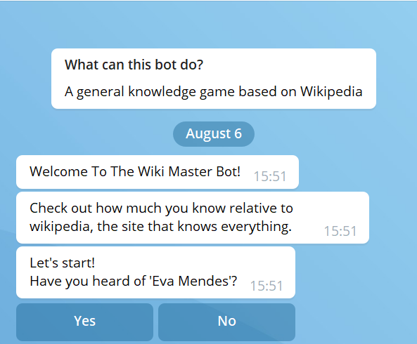
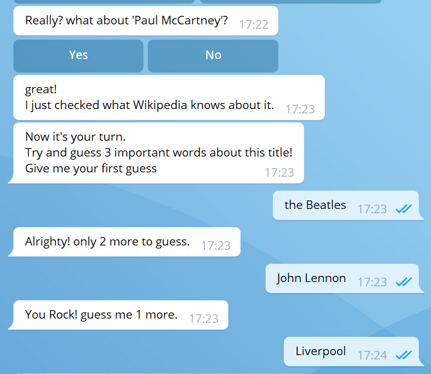
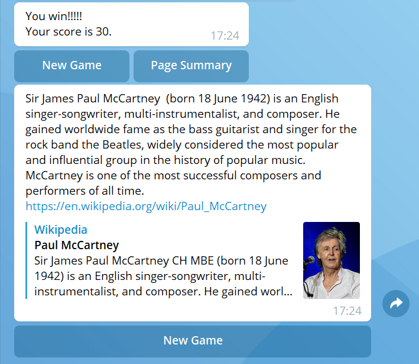

# WikiMaster
#### Play with this bot to test your general knowledge!

This game is for those who want to prove their knowledge at any price, 
even at a heavy price of playing against Wikipedia, the site that knows everything.

## Screenshots
**Winning Game**









## How to Run This Bot
### Prerequisites
 - Python 3.7
 - wikipedia library
 
### Setup
- Clone this repo from github

- Get a BOT ID from the botfather.

- Create a secret_settings.py file:
     ```
     BOT_TOKEN = "your-bot-token-here"
     ```
### Run   
To run the bot use:
   ```
   python bot.py
   ```
### Notes
- You get a large amount of data on the first run

## Credits and References
- [Telegram Docs](https://core.telegram.org/bots)
- [Wikipedia Documentation](https://wikipedia.readthedocs.io/en/latest/code.html)
